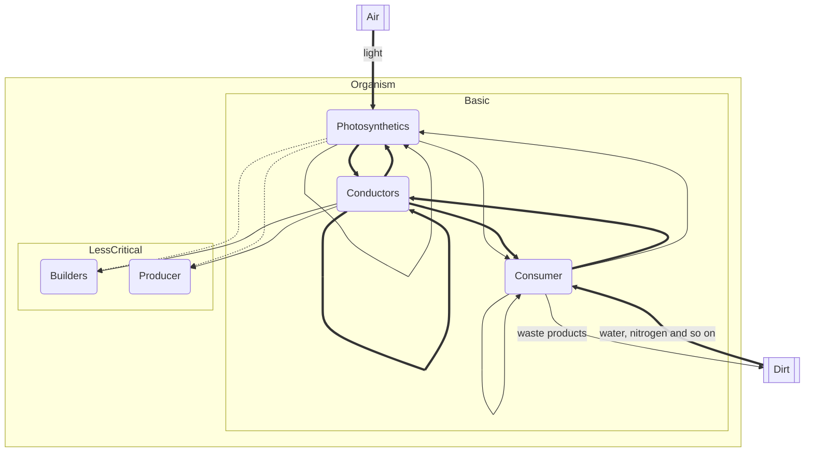

![alt][logo]

<b>_Dryad_</b> is a simple simulation of the behavior of virtual cells.

Features
---
The world, namely the grid, is represented by 3 types of segments: air, soil and cells. 
Air is only a space that has only physical properties that affect the habitat of cells. 
The soil also has physical properties, but the soil also has chemical properties, which makes the soil a rich source of resources. 
Cells are a key part of the simulation, they can divide, exchange energy, as well as nutrients. 
 
All cells are divided into several types:
* Photosynthetics are cells that are able to produce energy from light, while spending resources extracted from the soil;
* Conductors - cells that provide maximum metabolism and energy, consume little energy, are able to move energy quickly and with greater capacity;
* Builders are cells that ensure the growth of the body;
* Producer are cells that ensure the birth of a new individual;
* Consumer - cells acting as roots are the only cells that are able to interact with the soil directly.

[logo]: ./assets/imgs/logo.png